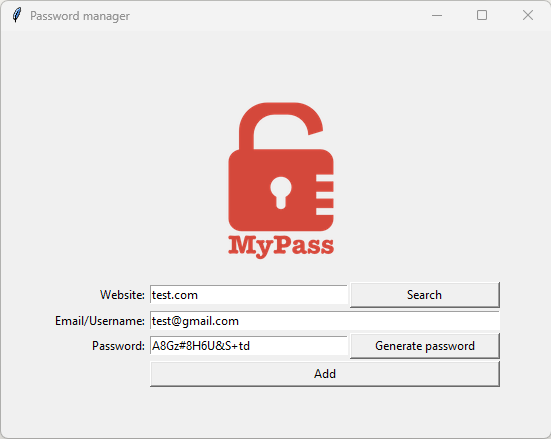

# Day 29 – Password Manager

A Tkinter desktop app that generates secure passwords and saves them to a local file. The user enters a website and username, generates a password with one click, and confirms before saving. Generated passwords are also automatically copied to the clipboard via `pyperclip`.

The main new thing here was auto-filling entry fields with a default username or a randomly generated password, and clearing them after saving.

**Day 30 update:** Added a search function to retrieve saved credentials by website. Data is now stored in JSON instead of plain text, and `try/except/else` is used to handle possible errors in the search functionality.

