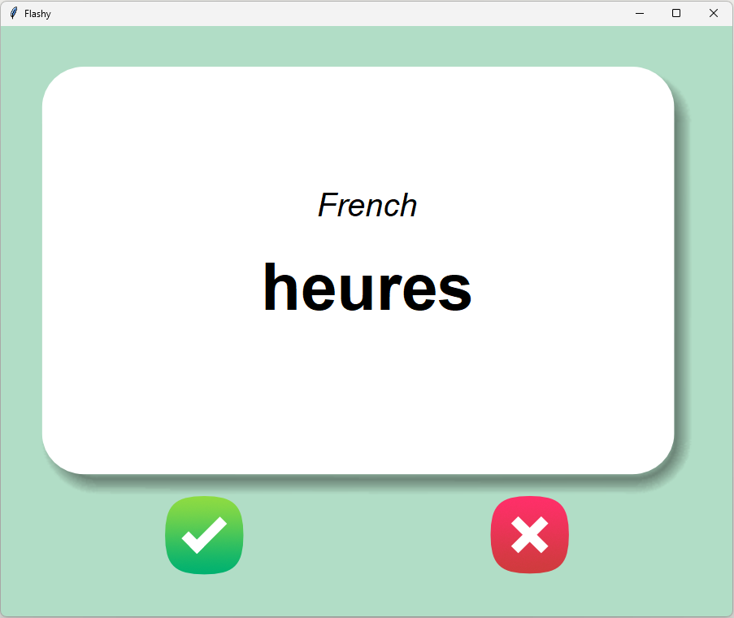
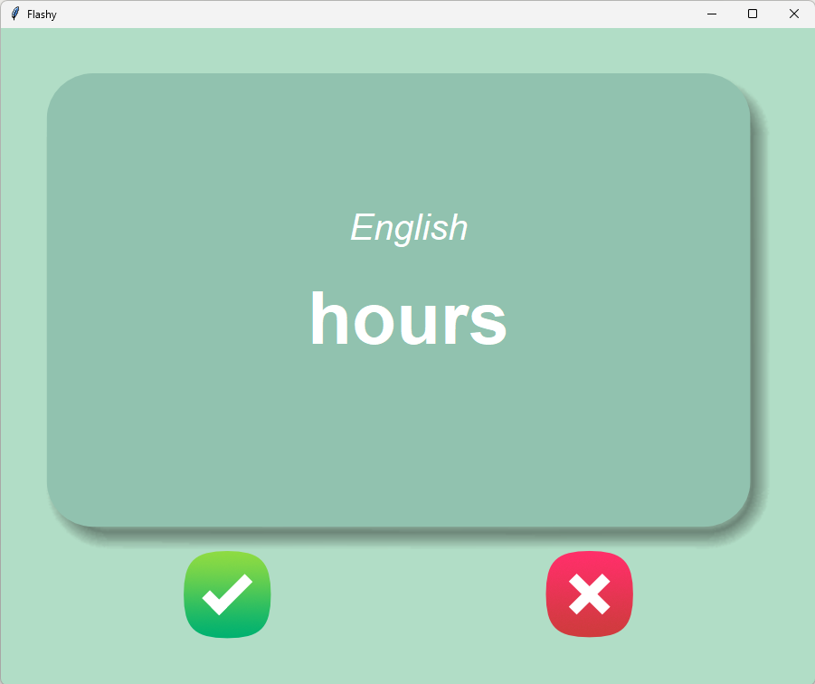

# Day 31 - Flash Card App

A flash card app built with Tkinter. With the current data, it shows the user a flash card with a word in French. After 3 seconds the card flips to reveal the translation. If guessed correctly, the word is removed from the deck. Otherwise the word will appear again in the future. The deck is stored in a csv file, so progress is saved between runs.

This project was about working with csv files with pandas and connecting the data to a live GUI. The trickiest part was converting between dataframes, lists of dictionaries, and lists of tuples depending on what the task required.

